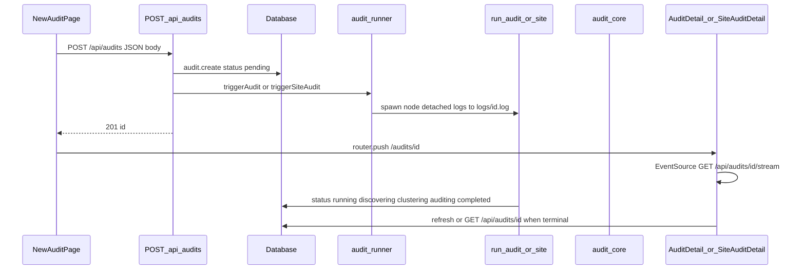

# Audit flow after Submit

## End-to-end order

## 1. Client: form submit

`[app/audits/new/page.tsx](app/audits/new/page.tsx)`

- Builds JSON: **site** mode → `{ url, mode, maxDepth, maxUrls }`; **page** mode → `{ url, mode, viewport }`.
- `POST /api/audits` with that body.
- On success, reads `{ id }` and `router.push(`/audits/${id}`)`.
- On error, shows message and clears loading (note: success path does not call `setLoading(false)` before navigation; the next page mounts fresh).

## 2. API: create row and fork worker

`[app/api/audits/route.ts](app/api/audits/route.ts)`

- Validates URL and clamps `maxDepth` / `maxUrls`; normalizes `mode` and `viewport`.
- `prisma.audit.create` with `status: 'pending'` and mode-specific fields (`maxDepth`/`maxUrls` vs `viewport`).
- **Page:** `[triggerAudit](lib/audit-runner.ts)` → `node scripts/run-audit.js <auditId> <url> [viewport]`.
- **Site:** `[triggerSiteAudit](lib/audit-runner.ts)` → `node scripts/run-site-audit.js <auditId> <url> <maxDepth> <maxUrls>`.
- Returns `{ id }` immediately; the worker runs **detached** with stdout/stderr appended to `[logs/<auditId>.log](lib/audit-runner.ts)`.

## 3. Background workers

`[lib/audit-runner.ts](lib/audit-runner.ts)` — only spawns processes; no audit logic.

**Quick Check — `[scripts/run-audit.js](scripts/run-audit.js)`**

1. `prisma.audit.update` → `status: 'running'`.
2. Launches Playwright Chromium.
3. Calls `[auditPageAtViewport](lib/audit-core.js)` from `[lib/audit-core.js](lib/audit-core.js)` (axe scan, RGAA criteria via LLM when Ollama is healthy, evidence under `public/audit-evidence/<auditId>/`).
4. Optional LLM element fix suggestions via `[utils/llmClient.js](utils/llmClient.js)` → `elementFixSuggestion` rows.
5. Batches `criterionResult.createMany` linked to the audit (page mode: no `viewportResultId` in the snippet you have — tied at audit level).
6. Final `prisma.audit.update` → `status: 'completed'`, compliance stats, `rawAxeResults`, etc. On failure → `status: 'failed'` + `errorMessage`.

**Full site — `[scripts/run-site-audit.js](scripts/run-site-audit.js)`**

1. `discovering`: sitemap/crawl (same file, large inline discovery), `discoveredPage` rows, `discoveryMethod` / `totalDiscovered`.
2. `clustering`: Playwright loads pages, structural hash (cheerio-based when available), `pageTemplate` rows + links; `statistics.siteProgress` updated for UI.
3. `auditing`: for each template needing audit, runs `auditPageAtViewport` for **desktop, tablet, mobile**; creates `viewportResult` + `criterionResult` rows; updates `totalAudited` and progress blobs.
4. Hash cache / legal summary aggregation → `status: 'completed'` with site-level `complianceRate`, `legalSummary`, etc.

Shared engine: `[lib/audit-core.js](lib/audit-core.js)` — Playwright navigation, `@axe-core/playwright`, RGAA mapping from `[constants/rgaaMapping.complete.js](constants/rgaaMapping.complete.js)` (referenced in core), LLM analysis path.

Transforms for API/UI shape (not part of the worker path): `[lib/transform-audit.ts](lib/transform-audit.ts)` (page), `[lib/transform-site-audit.ts](lib/transform-site-audit.ts)` (site).

## 4. Detail page after redirect

`[app/audits/[id]/page.tsx](app/audits/[id]/page.tsx)`

- Server component: `prisma.audit.findUnique` with relations (`criteria`, `templates`, `viewportResults`, etc.).
- **Page mode:** renders `[AuditDetail](components/AuditDetail.tsx)` with `transformAuditForUI` when completed and criteria exist.
- **Site mode:** builds `siteData` via `transformSiteAuditForUI` and renders `[SiteAuditDetail](components/SiteAuditDetail.tsx)`.

## 5. Live progress and refresh

- `[app/api/audits/[id]/stream/route.ts](app/api/audits/[id]/stream/route.ts)` — SSE that polls Prisma every 5s (site) or 10s (page); emits progress from `audit.statistics.quickProgress` or `siteProgress`; closes when status is `completed` or `failed`; can mark stale audits failed after unchanged polls (with exceptions while `running`/`auditing`).
- `[components/notifications/useAuditStream.ts](components/notifications/useAuditStream.ts)` — `EventSource` wrapper used by detail components.
- `[app/api/audits/[id]/route.ts](app/api/audits/[id]/route.ts)` — `GET` returns JSON for client refetch; `PATCH` marks non-terminal audits as `failed` (cancel).

## File responsibility cheat sheet

| File                                  | Role                                             |
| ------------------------------------- | ------------------------------------------------ |
| `app/audits/new/page.tsx`             | POST create, navigate to detail                  |
| `app/api/audits/route.ts`             | Persist audit, start worker                      |
| `lib/audit-runner.ts`                 | Detached `spawn` + log file                      |
| `scripts/run-audit.js`                | Single-page pipeline                             |
| `scripts/run-site-audit.js`           | Discover → cluster → multi-viewport per template |
| `lib/audit-core.js`                   | One URL + viewport: axe + RGAA/LLM analysis      |
| `app/audits/[id]/page.tsx`            | Load audit, pick Site vs Quick UI                |
| `app/api/audits/[id]/stream/route.ts` | SSE progress                                     |
| `app/api/audits/[id]/route.ts`        | GET snapshot, PATCH cancel, DELETE               |
| `lib/transform-*.ts`                  | Shape DB rows for UI/API JSON                    |

No code changes are required for this explanation; this is a read-only map of the existing flow.
